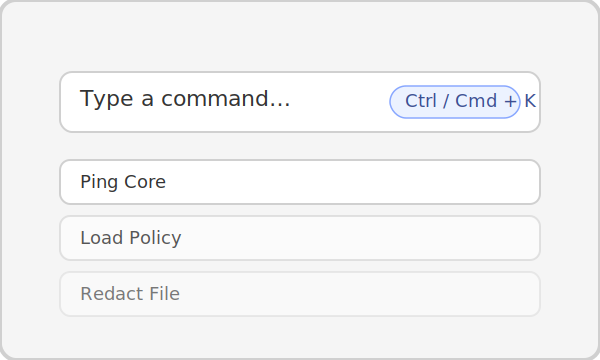

# Install Data Guardian on Linux

This guide uses Ubuntu 22.04 LTS as the reference distribution. Adjust package commands to match
your distro. You will compile Rust, build the React renderer, and package the Python runtime.



## Prerequisites
- Ubuntu 22.04 LTS (or similar) with sudo access
- 5 GB free disk space
- Build-essential toolchain (`gcc`, `make`, `pkg-config`)
- libayatana-appindicator3 (needed by Tauri system tray integration)

## 1. Install system dependencies
```bash
sudo apt update
sudo apt install -y build-essential curl pkg-config libssl-dev libgtk-3-dev \
  libayatana-appindicator3-1 librsvg2-dev
```

## 2. Install language toolchains
```bash
# Rust and cargo
curl https://sh.rustup.rs -sSf | sh -s -- -y
source "$HOME/.cargo/env"

# Node.js 18 LTS
curl -fsSL https://deb.nodesource.com/setup_18.x | sudo -E bash -
sudo apt install -y nodejs

# Python 3.11
sudo add-apt-repository ppa:deadsnakes/ppa -y
sudo apt update
sudo apt install -y python3.11 python3.11-venv python3.11-dev
python3.11 -m ensurepip --upgrade
```

## 3. Clone the repository
```bash
mkdir -p ~/code
cd ~/code
git clone https://github.com/<your-org>/data-guardian.git
cd data-guardian
```

## 4. Prepare the Python environment (optional for CLI/tests)
```bash
python3.11 -m venv .venv
source .venv/bin/activate
pip install -r data_guardian/requirements.txt
```
Leave the virtual environment active if you plan to run unit tests. Otherwise use `deactivate` to
return to your shell.

## 5. Install JavaScript dependencies
```bash
npm --prefix desktop_app/ui install
```

## 6. Run the desktop shell
```bash
npm --prefix desktop_app/ui run tauri:dev
```

The Tauri host spins up the Python core and connects over a Unix domain socket at
`~/.local/share/data-guardian/ipc.sock`. If the socket does not appear, see the
[troubleshooting guide](troubleshooting.md).

## 7. Build an AppImage (optional)
```bash
npm --prefix desktop_app/ui run build
node scripts/build_dg_core.mjs
cargo tauri build --manifest-path desktop_app/tauri/src-tauri/Cargo.toml
```
AppImages and other bundles are stored in
`desktop_app/tauri/src-tauri/target/release/bundle/`. Follow the [release checklist](release.md) when
preparing production builds.

## Next steps
- Read the [user guide](user_guide.md) to explore workflows.
- Refer to [contributing](contributing.md) before opening pull requests.
