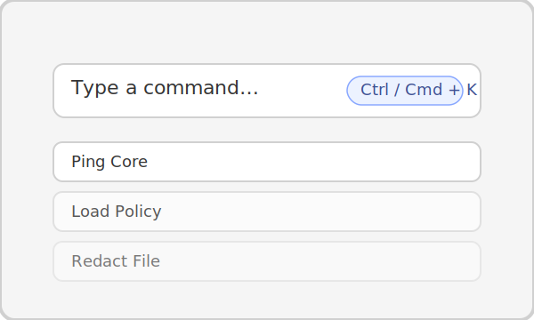

# Install Data Guardian on Windows

This guide targets Windows 11 22H2 (x64) but also applies to Windows 10 with the same toolchains.
Run PowerShell as Administrator for the install steps.



## Prerequisites
- Windows 10 22H2 or Windows 11 22H2 (x64)
- Administrator rights and at least 5 GB of free storage
- [Windows Subsystem for Linux is **not** required]

## 1. Install language toolchains
```powershell
# Install Rust (includes cargo)
winget install --id Rustlang.Rustup -e --source winget
rustup update stable

# Install Node.js 18 LTS
winget install --id OpenJS.NodeJS.LTS -e --source winget

# Install Python 3.11
winget install --id Python.Python.3.11 -e --source winget
py -3.11 -m pip install --upgrade pip
```
If `winget` is unavailable, install the equivalents via the Microsoft Store, or download installers
from the respective vendor websites. After installing Python, ensure `py -3.11` resolves correctly.

## 2. Clone the repository
```powershell
cd $env:USERPROFILE\source
if (!(Test-Path .\repos)) { New-Item -ItemType Directory -Path .\repos | Out-Null }
cd .\repos
git clone https://github.com/<your-org>/data-guardian.git
cd data-guardian
```

## 3. Prepare the Python environment
```powershell
py -3.11 -m venv .venv
.\.venv\Scripts\Activate.ps1
pip install -r data_guardian\requirements.txt
deactivate
```
Keep the virtual environment handy for running unit tests or using the CLI directly.

## 4. Install JavaScript dependencies
```powershell
npm --prefix desktop_app\ui install
```

## 5. Run the desktop shell
```powershell
npm --prefix desktop_app\ui run tauri:dev
```

The development shell packages the Python core bundle and launches the desktop window. Windows
builds communicate over the named pipe `\\.\pipe\data_guardian_ipc`. If the window remains blank,
check the console output for missing Visual C++ redistributables.

## 6. Produce an installer (optional)
```powershell
npm --prefix desktop_app\ui run build
node scripts\build_dg_core.mjs
cargo tauri build --manifest-path desktop_app/tauri/src-tauri/Cargo.toml
```
Installer binaries are emitted under
`desktop_app\tauri\src-tauri\target\release\bundle\msi\` by default. Refer to the
[release checklist](release.md) for signing guidance.

## Next steps
- Explore the [user guide](user_guide.md).
- Review [troubleshooting tips](troubleshooting.md) for pipe or permission issues.
- Follow the [contributing guidelines](contributing.md) when preparing pull requests.
