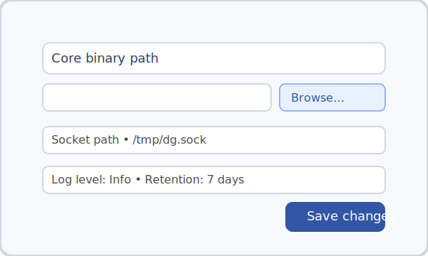
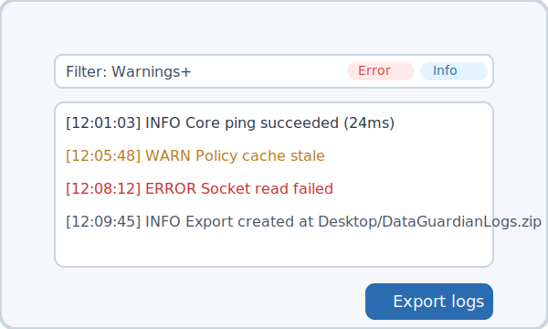

# Data Guardian Desktop – User Guide

This guide walks through the core workflows available in the Data Guardian desktop shell. The UI is designed to feel familiar on every platform while keeping powerful automation close at hand.

## Command Palette

The command palette is the fastest way to perform any action. Press **Ctrl/Cmd + K** or click the shortcut pill in the header to open it. Start typing to filter the available commands and hit **Enter** to run the first match.

Available commands:

- **Ping Core** – verifies connectivity with the core binary and reports latency.
- **Load Policy** – refreshes the active policy bundle.
- **Select Path to Scan** – choose the directory that will be scanned next.
- **Redact File** – queue a file for redaction.
- **View Logs** – jump directly to the logs tab.
- **Open Config Folder** – reveal the configuration directory in your file browser.

Every action provides inline feedback so you always know what happened.

## Settings

Open the **Settings** tab to review and update integration details. You can override the path to the core binary, regenerate the socket/pipe path, and fine tune logging preferences such as level and retention.

Use **Save changes** after editing to persist your updates.

## Logs

The **Logs** tab brings observability to the forefront. Filter entries by severity level, copy visible log lines to the clipboard, or export everything as a zip archive for deeper inspection.

## Tips

- You can access command palette actions from anywhere inside the application.
- Toast notifications summarize results so you can keep working without losing context.
- Recreate the socket path if your connection ever becomes unstable.
- Exporting logs generates a zip that you can attach to support tickets or share with your security team.

For further assistance, reach out to the Core Security Engineering team.
